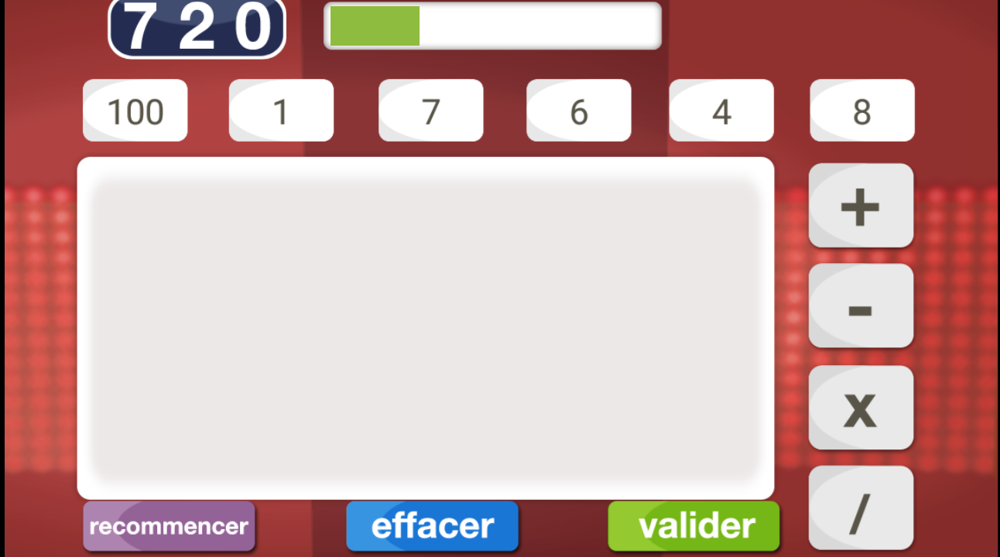

<!DOCTYPE html>
<html>
<head>
    <meta charset="utf-8"/>
    <link rel="stylesheet" href="misenforme.css">
    <title>Le jeu du compte est bon</title>
</head>
<body>
    

        
    

    <h1>Mon projet : Le compte est bon ?</h1>
    <h4>Projet créé avec la collaboration de Yassine HABA et SOUIDI Zakaria, deux élèves de Mme Claire SAGADEVIN</h4>

    <h2>Accueil</h2>
    
Bonjour et bienvenue sur la page de mon jeu "Le compte est bon". Aujourd'hui, je vais vous présenter le fonctionnement du jeu, son concept et les problèmes rencontrés, afin que vous ayez un aperçu de ce que j'ai pu réaliser. Cela vous donnera une idée de ce que nous faisons en NSI. Sur ce, bonne visite et nous espérons que mon site web vous plaira.

    <h3>Sommaire</h3>
    <ol>
        <li>L'histoire du jeu</li>
        <li>Concept du jeu</li>
        <li>Explication du programme</li>
        <li>Difficultés rencontrées</li>
    </ol>
    
    <h3>L'histoire du jeu</h3>
    
Mon projet est inspiré du célèbre jeu télévisé "Des Chiffres et Des Lettres", connu dans le monde entier et en différentes langues. 
        <a href="https://www.youtube.com/watch?v=X1jwjiEQG9Y">Vidéo du jeu à l'étranger</a>. 
        L’émission est composée de trois types d’épreuves : 
        1. Le Compte est bon 
        2. Le Mot le plus long 
        3. Les duels 
        J'ai programmé la première partie du jeu qui est "Le Compte est bon".
    

    
    

        <a href="https://fr.wikipedia.org/wiki/Des_chiffres_et_des_lettres#Le_Compte_est_Bon">Plus de détails sur Le Compte est Bon</a>
    

    <h3>Concept du jeu</h3>
    

        • Donner, de façon aléatoire, à l’utilisateur six entiers naturels entre 1 et 75, ainsi qu'un grand nombre (100 ≤ ? ≤ 1000) comme cible (nombre à viser). 
        • Trouver la meilleure combinaison d’opérations élémentaires (Addition, Soustraction, Multiplication, Division) entre les six chiffres donnés. 
        • Afficher le résultat (<a href="https://www.youtube.com/watch?v=t_4dAYk5ySY">Vidéo extrait du vrai jeu Des Chiffres et Des Lettres</a>).
    

    <h1>Image de référence du vrai jeu</h1>
    

        
    

    

        
    

    
    
Le jeu "Le compte est bon" est un jeu très simple qui existe sous plusieurs formats (mobile ou PC). Le but est de retrouver le nombre proposé aléatoirement avec une série de nombres également tirés aléatoirement. Pour cela, vous pouvez additionner, multiplier, diviser ou soustraire deux chiffres entre eux. Cependant, les nombres proposés ne peuvent être utilisés qu'une seule fois. Une fois le nombre du départ retrouvé, vous êtes le vainqueur. Si vous ne le trouvez pas, vous avez échoué. Un exemple vous permettra de mieux comprendre le jeu :

    
    
Pour ceux qui veulent voir la description du code détaillée et les difficultés rencontrées, cliquez <a href="index2.html">ici</a>.

</body>
</html>
